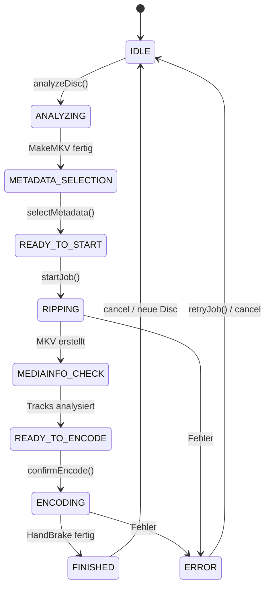

# Backend-Services

Das Backend ist in Node.js/Express geschrieben und in **Services** aufgeteilt, die jeweils eine klar abgegrenzte Verantwortlichkeit haben.

---

## pipelineService.js

**Der Kern von Ripster** – orchestriert den gesamten Ripping-Workflow.

### Zuständigkeiten

- Verwaltung des Pipeline-Zustands als State Machine
- Koordination zwischen allen externen Tools
- Generierung von Encode-Plänen
- Fehlerbehandlung und Recovery

### Haupt-Methoden

| Methode | Beschreibung |
|---------|-------------|
| `analyzeDisc()` | Startet MakeMKV-Analyse der eingelegten Disc |
| `selectMetadata(jobId, omdbData, playlist)` | Setzt Metadaten und Playlist für einen Job |
| `startJob(jobId)` | Startet den Ripping-Prozess |
| `confirmEncode(jobId, trackSelection)` | Bestätigt Encode mit Track-Auswahl |
| `cancelPipeline()` | Bricht aktiven Prozess ab |
| `retryJob(jobId)` | Wiederholt fehlgeschlagenen Job |
| `reencodeJob(jobId)` | Encodiert bestehende Raw-MKV neu |

### Zustandsübergänge



---

## diskDetectionService.js

Überwacht das Disc-Laufwerk auf Disc-Einleger- und Auswurf-Ereignisse.

### Modi

| Modus | Beschreibung |
|------|-------------|
| `auto` | Erkennt verfügbare Laufwerke automatisch |
| `explicit` | Überwacht ein bestimmtes Gerät (z.B. `/dev/sr0`) |

### Polling

Der Service pollt das Laufwerk im konfigurierten Intervall (`disc_poll_interval_ms`, Standard: 5000ms) und emittiert Events:

```js
// Ereignisse
emit('disc-detected', { device: '/dev/sr0' })
emit('disc-removed', { device: '/dev/sr0' })
```

---

## processRunner.js

Verwaltet externe CLI-Prozesse.

### Features

- **Streaming**: stdout/stderr werden zeilenweise gelesen
- **Progress-Callbacks**: Ermöglicht Echtzeit-Fortschrittsanzeige
- **Graceful Shutdown**: SIGINT → Warte-Timeout → SIGKILL
- **Prozess-Registry**: Verfolgt aktive Prozesse für sauberes Beenden

### Nutzung

```js
const result = await runProcess(
  'HandBrakeCLI',
  ['--input', rawFile, '--output', outputFile, '--preset', preset],
  {
    onStderr: (line) => parseHandBrakeProgress(line),
    onStdout: (line) => logger.debug(line)
  }
);
```

---

## websocketService.js

WebSocket-Server für Echtzeit-Client-Kommunikation.

### Betrieb

- Läuft auf Pfad `/ws` des Express-Servers
- Hält eine Registry aller verbundenen Clients
- Ermöglicht Broadcast an alle Clients oder gezieltes Senden

### API

```js
broadcast({ type: 'PIPELINE_STATE_CHANGE', data: { state, jobId } });
broadcast({ type: 'PROGRESS_UPDATE', data: { progress, eta } });
```

---

## omdbService.js

Integration mit der [OMDb API](https://www.omdbapi.com/).

### Methoden

| Methode | Beschreibung |
|---------|-------------|
| `searchByTitle(title, type)` | Suche nach Titel (movie/series) |
| `fetchById(imdbId)` | Vollständige Metadaten per IMDb-ID |

### Zurückgegebene Daten

```json
{
  "imdbId": "tt1375666",
  "title": "Inception",
  "year": "2010",
  "type": "movie",
  "poster": "https://...",
  "plot": "...",
  "director": "Christopher Nolan"
}
```

---

## settingsService.js

Verwaltet alle Anwendungseinstellungen.

### Features

- **Schema-getriebene Validierung**: Jede Einstellung hat Typ, Grenzen und Pflichtfeld-Flag
- **Kategorisierung**: Einstellungen sind in Kategorien gruppiert (Paths, Tools, Encoding, ...)
- **Persistenz**: Werte in SQLite, Schema ebenfalls in SQLite
- **Defaults**: `defaultSettings.js` definiert Standardwerte

### Einstellungs-Kategorien

| Kategorie | Einstellungen |
|-----------|--------------|
| `paths` | `raw_dir`, `movie_dir`, `log_dir` |
| `tools` | `makemkv_command`, `handbrake_command`, `mediainfo_command` |
| `encoding` | `handbrake_preset`, `handbrake_extra_args`, `output_extension`, `filename_template` |
| `drive` | `drive_mode`, `drive_device`, `disc_poll_interval_ms` |
| `makemkv` | `makemkv_min_length_minutes`, `makemkv_backup_mode` |
| `omdb` | `omdb_api_key`, `omdb_default_type` |
| `notifications` | `pushover_user_key`, `pushover_api_token` |

---

## historyService.js

Datenbankoperationen für Job-Historie.

### Hauptoperationen

| Operation | Beschreibung |
|-----------|-------------|
| `listJobs(filters)` | Jobs nach Status/Titel filtern |
| `getJob(id)` | Job-Details mit Logs abrufen |
| `findOrphanRawFolders()` | Nicht-getrackte Raw-Ordner finden |
| `importOrphanRaw(path)` | Orphan-Ordner als Job importieren |
| `assignOmdb(id, omdbData)` | OMDb-Metadaten nachträglich zuweisen |
| `deleteJob(id, deleteFiles)` | Job und optional Dateien löschen |

---

## notificationService.js

PushOver-Push-Benachrichtigungen.

```js
await notify({
  title: 'Ripster: Job abgeschlossen',
  message: 'Inception (2010) wurde erfolgreich encodiert'
});
```

---

## logger.js

Strukturiertes Logging mit täglicher Log-Rotation.

### Log-Level

| Level | Verwendung |
|-------|-----------|
| `debug` | Detaillierte Entwicklungs-Informationen |
| `info` | Normale Betriebsereignisse |
| `warn` | Warnungen, die Aufmerksamkeit benötigen |
| `error` | Fehler, die den Betrieb beeinträchtigen |

### Log-Dateien

```
logs/
├── ripster-2024-01-15.log    ← Tages-Log
└── jobs/
    └── job-42-handbrake.log  ← Prozess-spezifische Logs
```
