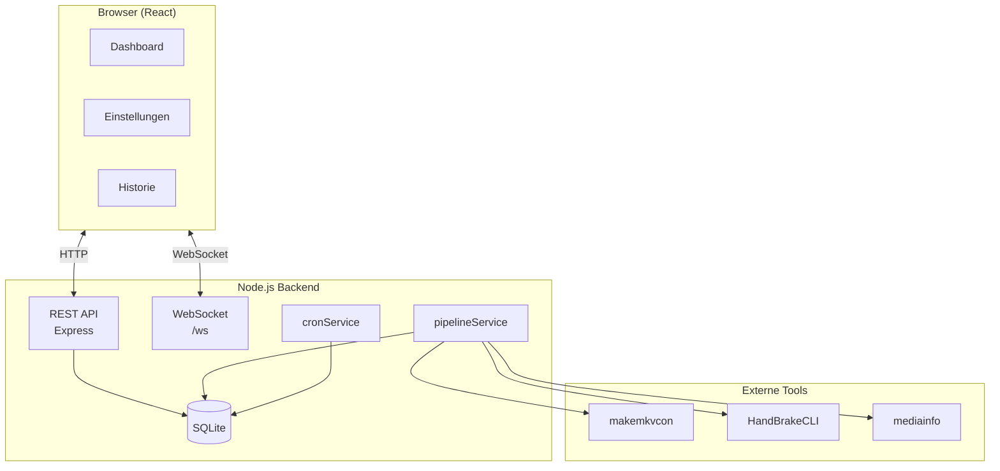

# Architektur

Ripster ist eine Client-Server-Anwendung mit REST + WebSocket.

---

## Systemüberblick

---

## Schichten

### Backend

- `src/index.js` (Bootstrapping, Routes, WS, Services)
- `src/routes/*` (Pipeline, Settings, History, Crons)
- `src/services/*` (Business-Logik)
- `src/db/database.js` (Init/Migration)
- `src/utils/*` (Parser, Dateifunktionen, Validierung)

### Frontend

- `App.jsx` + `pages/*` (Dashboard, Settings, History)
- `components/*` (Status-/Review-/Dialog-Komponenten)
- `api/client.js` (REST-Client)
- `hooks/useWebSocket.js` (WS-Reconnect)

---

## Weiterführend

- [:octicons-arrow-right-24: Übersicht](overview.md)
- [:octicons-arrow-right-24: Backend-Services](backend.md)
- [:octicons-arrow-right-24: Frontend-Komponenten](frontend.md)
- [:octicons-arrow-right-24: Datenbank](database.md)

