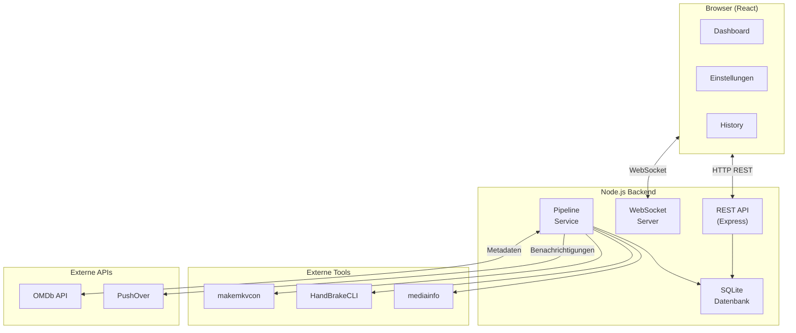

# Architektur

Ripster ist als klassische **Client-Server-Anwendung** mit Echtzeit-Kommunikation über WebSockets aufgebaut.

---

## Systemüberblick



---

## Schichten-Architektur

### Backend

```
index.js (Express Server)
├── Routes (API-Endpunkte)
│   ├── pipelineRoutes.js
│   ├── settingsRoutes.js
│   └── historyRoutes.js
├── Services (Business Logic)
│   ├── pipelineService.js    ← Kern-Orchestrierung
│   ├── diskDetectionService.js
│   ├── processRunner.js
│   ├── websocketService.js
│   ├── omdbService.js
│   ├── settingsService.js
│   ├── notificationService.js
│   ├── historyService.js
│   └── logger.js
├── Database
│   ├── database.js
│   └── defaultSettings.js
└── Utils
    ├── encodePlan.js
    ├── playlistAnalysis.js
    ├── progressParsers.js
    └── files.js
```

### Frontend

```
App.jsx (React Router)
├── Pages
│   ├── DashboardPage.jsx     ← Haupt-Interface
│   ├── SettingsPage.jsx
│   └── DatabasePage.jsx      ← Historie/DB-Ansicht
├── Components
│   ├── PipelineStatusCard.jsx
│   ├── MetadataSelectionDialog.jsx
│   ├── MediaInfoReviewPanel.jsx
│   ├── DynamicSettingsForm.jsx
│   └── JobDetailDialog.jsx
├── Hooks
│   └── useWebSocket.js
└── API
    └── client.js
```

---

## Weiterführende Dokumentation

<div class="grid cards" markdown>

-   [:octicons-arrow-right-24: Übersicht](overview.md)

-   [:octicons-arrow-right-24: Backend-Services](backend.md)

-   [:octicons-arrow-right-24: Frontend-Komponenten](frontend.md)

-   [:octicons-arrow-right-24: Datenbank](database.md)

</div>
