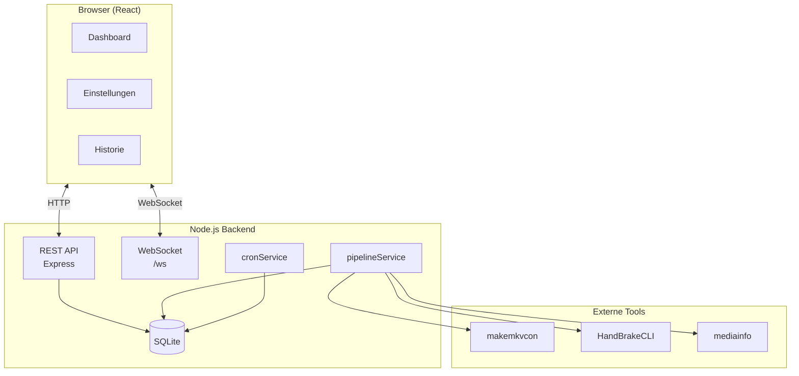

# Anhang: Architektur

Ripster ist eine Client-Server-Anwendung mit REST + WebSocket und externen CLI-Tools.

---

## Systemüberblick

---

## Details

- [:octicons-arrow-right-24: Übersicht](overview.md)
- [:octicons-arrow-right-24: Backend-Services](backend.md)
- [:octicons-arrow-right-24: Frontend-Komponenten](frontend.md)
- [:octicons-arrow-right-24: Datenbank](database.md)

