# Schnellstart – Vollständiger Workflow

Nach der [Installation](installation.md) und [Konfiguration](configuration.md) führt diese Seite Schritt für Schritt durch den ersten Rip – mit allen Details aus dem Code.

---

## Übersicht: Pipeline-Zustände

```mermaid
stateDiagram-v2
    direction LR
    [*] --> IDLE
    IDLE --> DISC_DETECTED: Disc eingelegt
    DISC_DETECTED --> METADATA_SELECTION: Analyse gestartet
    METADATA_SELECTION --> READY_TO_START: Metadaten bestätigt\n(keine Obfuskierung)
    METADATA_SELECTION --> WAITING_FOR_USER_DECISION: Obfuskierung erkannt\n→ Playlist wählen
    WAITING_FOR_USER_DECISION --> READY_TO_START: Playlist bestätigt
    READY_TO_START --> MEDIAINFO_CHECK: Vorhandene Raw-Datei\ngefunden
    READY_TO_START --> RIPPING: Ripping starten
    RIPPING --> MEDIAINFO_CHECK: MakeMKV fertig
    MEDIAINFO_CHECK --> READY_TO_ENCODE: Track-Review bereit
    READY_TO_ENCODE --> ENCODING: Encode bestätigt
    ENCODING --> FINISHED: Erfolg
    ENCODING --> ERROR: Fehler
    RIPPING --> ERROR: Fehler
```



---

## Schritt 1 – Ripster starten

```bash
cd ripster
./start.sh
```

Öffne [http://localhost:5173](http://localhost:5173) im Browser. Das Dashboard zeigt `IDLE`.

---

## Schritt 2 – Disc einlegen → `DISC_DETECTED`

Lege eine DVD oder Blu-ray ein. Der `diskDetectionService` pollt das Laufwerk alle `disc_poll_interval_ms` Millisekunden (Standard: 5 Sekunden).

**Was passiert im Code:**

- `diskDetectionService` emittiert `disc:inserted` mit Geräteinformationen
- `pipelineService.onDiscInserted()` wird aufgerufen
- Dashboard zeigt Badge **"Neue Disc erkannt"**
- Der **"Analyse starten"**-Button wird aktiv

!!! tip "Manuelle Auslösung"
    Falls die automatische Erkennung nicht greift:
    ```bash
    curl -X POST http://localhost:3001/api/pipeline/analyze
    ```

---

## Schritt 3 – Analyse starten → `METADATA_SELECTION`

Klicke auf **"Analyse starten"** oder warte auf automatischen Start.

**Was passiert im Code:**

1. Ein neuer Job-Datensatz wird in der Datenbank angelegt (`status: METADATA_SELECTION`)
2. Ripster versucht, den Titel automatisch aus dem Disc-Label/Modell zu ermitteln
3. Mit diesem erkannten Titel wird sofort eine **OMDb-Suche** ausgelöst
4. Der `MetadataSelectionDialog` öffnet sich im Frontend mit den vorgeladenen Suchergebnissen

**Erkannter Titel:** Der Disc-Label (z. B. `INCEPTION`) wird als Suchbegriff verwendet. Falls kein Label vorhanden, bleibt das Suchfeld leer.

---

## Schritt 4 – Metadaten auswählen (`MetadataSelectionDialog`)

Der Dialog zeigt vorgeladene OMDb-Suchergebnisse. Du kannst:

### 4a) OMDb-Suchergebnis wählen

```
┌─────────────────────────────────────────────────┐
│ Suche: [Inception                          ] 🔍 │
├─────────────────────────────────────────────────┤
│ ▶ Inception (2010)  ·  Movie  ·  tt1375666      │
│   Inception: ...    ·  Series ·  ...             │
├─────────────────────────────────────────────────┤
│                           [Auswahl übernehmen]  │
└─────────────────────────────────────────────────┘
```

- Suche durch Titel anpassen und Enter drücken
- Typ-Filter: `movie` / `series` umschalten möglich
- Einen Eintrag anklicken, dann **"Auswahl übernehmen"**

### 4b) Manuelle Eingabe (ohne OMDb)

Falls kein passendes Ergebnis gefunden wird:
- Titel, Jahr und IMDb-ID manuell eingeben
- OMDb-Poster wird übersprungen

**Was passiert nach Bestätigung:**

Ripster ruft `pipelineService.selectMetadata()` auf und führt sofort eine **Playlist-Analyse** durch:

- MakeMKV wird im Info-Modus gestartet
- Alle Titel und deren Segment-Reihenfolgen werden analysiert
- Das Ergebnis entscheidet über den nächsten Zustand (→ Schritt 5)

---

## Schritt 5 – Playlist-Situation (zwei Wege)

### 5a) Keine Obfuskierung → `READY_TO_START`

Der Dialog schließt sich automatisch. Die empfohlene Playlist wird still übernommen. Weiter zu **Schritt 6**.

### 5b) Obfuskierung erkannt → `WAITING_FOR_USER_DECISION`

Der **Playlist-Auswahl-Dialog** erscheint **zusätzlich** (nach dem Metadaten-Dialog):

```
┌───────────────────────────────────────────────────────────────┐
│ Playlist-Auswahl                                              │
│ Es wurden mehrere Titel mit ähnlicher Laufzeit gefunden.      │
│ Bitte wähle die korrekte Playlist:                            │
├───────────┬──────────┬────────┬──────────────────────────────┤
│ Playlist  │ Laufzeit │ Score  │ Bewertung                     │
├───────────┼──────────┼────────┼──────────────────────────────┤
│ ● 00800   │ 2:28:05  │  +18   │ wahrscheinlich korrekt        │
│           │          │        │ (lineare Segmentfolge)        │
├───────────┼──────────┼────────┼──────────────────────────────┤
│ ○ 00801   │ 2:28:12  │   −4   │ Auffällige Segmentreihenfolge │
├───────────┼──────────┼────────┼──────────────────────────────┤
│ ○ 00900   │ 2:28:05  │  −32   │ Fake-Struktur                 │
│           │          │        │ (alternierendes Sprungmuster) │
└───────────┴──────────┴────────┴──────────────────────────────┘
  847 Playlists insgesamt · 3 relevante Kandidaten (≥ 15 min)
  Empfehlung: 00800 (vorausgewählt)
                                           [Playlist bestätigen]
```

- Die empfohlene Playlist ist **vorausgewählt** (Radio-Button)
- Score und Bewertungslabel helfen bei der Entscheidung
- Nach Bestätigung: Pipeline wechselt zu `READY_TO_START`

!!! info "Scoring-Details"
    Wie die Scores berechnet werden, erklärt die [Playlist-Analyse](../pipeline/playlist-analysis.md)-Seite.

---

## Schritt 6 – Ripping starten → `RIPPING`

**Vorher prüft Ripster:** Existiert bereits eine Raw-Datei für diesen Job?

- **Ja, Raw-Datei vorhanden** → Direkt zu Schritt 7 (Track-Review), kein erneutes Ripping
- **Nein** → MakeMKV-Ripping startet

Klicke auf **"Starten"** im Dashboard.

**Was MakeMKV ausführt (MKV-Modus):**

```bash
makemkvcon mkv disc:0 all /mnt/raw/Inception-2010/ \
  --minlength=900 -r
```

**Was MakeMKV ausführt (Backup-Modus):**

```bash
makemkvcon backup disc:0 /mnt/raw/Inception-2010-backup/ \
  --decrypt -r
```

**Live-Fortschritt** wird aus der MakeMKV-Ausgabe geparst:

```
PRGV:2048,0,65536  → Fortschritt wird berechnet und per WebSocket gesendet
PRGT:5011,0,"Sichern..."  → Aktueller Task-Name
```

**Typische Dauer:**
- DVD: 20–45 Minuten
- Blu-ray: 45–120 Minuten

---

## Schritt 7 – Track-Review → `READY_TO_ENCODE`

Nach dem Ripping (oder direkt bei vorhandener Raw-Datei) startet der **HandBrake-Scan**:

```bash
HandBrakeCLI --scan -i <quelle> -t 0
```

Dieser Scan liest alle Tracks aus ohne zu encodieren. Ripster baut daraus den Encode-Plan mit automatischer Vorauswahl:

**Status: `MEDIAINFO_CHECK`** – läuft automatisch, kein Benutzereingriff

Danach öffnet sich das **Encode-Review-Panel** (`READY_TO_ENCODE`):

```
┌─────────────────────────────────────────────────────────────────┐
│ Encode-Review                                                   │
│ Titel: Disc Title 1  ·  Laufzeit: 2:28:05  ·  28 Kapitel       │
├─────────────────────────────────────────────────────────────────┤
│ Audio-Spuren                                                    │
├──────┬─────────────────────────────┬───────────────────────────┤
│  ☑  │ Track 1: English (AC3, 5.1)  │ Copy (ac3)                │
│  ☑  │ Track 2: Deutsch (DTS, 5.1)  │ Fallback Transcode (av_aac)│
│  ☐  │ Track 3: Français (AC3, 2.0) │ Nicht übernommen          │
├──────┴─────────────────────────────┴───────────────────────────┤
│ Untertitel-Spuren                                               │
├──────┬─────────────────────────────┬────────┬──────┬──────────┤
│  ☑  │ Track 1: Deutsch             │ Einbr.☐ │Forc.☐│Default☑ │
│  ☐  │ Track 2: English             │ Einbr.☐ │Forc.☐│Default☐ │
├──────┴─────────────────────────────┴────────┴──────┴──────────┤
│                                  [Encode bestätigen]           │
└─────────────────────────────────────────────────────────────────┘
```

### Audio-Track-Aktionen verstehen

| Symbol/Text | Bedeutung |
|------------|-----------|
| `Copy (ac3)` | Track wird **verlustfrei** direkt übernommen |
| `Copy (truehd)` | TrueHD-Track wird direkt übernommen |
| `Transcode (av_aac)` | Track wird zu AAC umgewandelt |
| `Fallback Transcode (av_aac)` | Copy nicht möglich → automatisch zu AAC |
| `Preset-Default (HandBrake)` | HandBrake-Preset entscheidet |
| `Nicht übernommen` | Track ist nicht ausgewählt |

### Untertitel-Flags

| Flag | Bedeutung |
|------|-----------|
| **Einbrennen** | Untertitel werden fest ins Video gebrannt (nur ein Track möglich) |
| **Forced** | Nur erzwungene Untertitel-Einblendungen übernehmen |
| **Default** | Diese Spur wird beim Abspielen automatisch aktiviert |

### Vorauswahl-Regeln

Die Tracks mit `☑` wurden nach der Regel aus den Einstellungen automatisch vorausgewählt (`selectedByRule: true`). Die Auswahl kann frei geändert werden.

Klicke **"Encode bestätigen"** um fortzufahren.

---

## Schritt 8 – Encoding → `ENCODING`

HandBrake startet mit dem finalisierten Plan:

```bash
HandBrakeCLI \
  -i /dev/sr0 \
  -o "/mnt/movies/Inception (2010).mkv" \
  -t 1 \
  --preset "H.265 MKV 1080p30" \
  -a 1,2 \
  -E copy:ac3,av_aac \
  -s 1 \
  --subtitle-default 1
```

**Live-Fortschritt** wird aus HandBrake-stderr geparst:

```
Encoding: task 1 of 1, 73.50 % (45.23 fps, avg 44.12 fps, ETA 00h12m34s)
```

Das Dashboard zeigt:
- Fortschrittsbalken (0–100 %)
- Aktuelle Encoding-Geschwindigkeit (FPS)
- Geschätzte Restzeit (ETA)

**Typische Dauer (abhängig von CPU/GPU und Preset):**
- Schnelles Preset (`fast`): 0.5× Echtzeit
- Standard-Preset: 1–3× Echtzeit
- Langsames Preset (`slow`): 5–10× Echtzeit

---

## Schritt 9 – Fertig! → `FINISHED`

```
/mnt/nas/movies/
└── Inception (2010).mkv   ✓ Encodierung abgeschlossen
```

- Job-Status in der Datenbank: `FINISHED`
- PushOver-Benachrichtigung (falls konfiguriert)
- Eintrag in der [History](http://localhost:5173/history) mit vollständigen Logs

---

## Fehlerbehandlung

### Job im Status `ERROR`

1. **Dashboard**: Details-Button → Log-Ausgabe prüfen
2. **Retry**: Job vom Fehlerzustand neu starten (behält Metadaten)
3. **History**: Vollständige Logs und Fehlerdetails

### Häufige Fehlerursachen

| Fehler | Ursache | Lösung |
|-------|---------|--------|
| MakeMKV: Lizenzfehler | Abgelaufene Beta-Lizenz | Neue Lizenz im [MakeMKV-Forum](https://www.makemkv.com/forum/viewtopic.php?t=1053) |
| HandBrake: Preset nicht gefunden | Preset-Name falsch | `HandBrakeCLI --preset-list` prüfen |
| Keine Disc erkannt | Laufwerk-Berechtigungen | `sudo chmod a+rw /dev/sr0` |
| Falsches Video (zerstückelt) | Falsche Playlist | Job re-encodieren mit anderer Playlist |
| OMDb: Keine Ergebnisse | API-Key fehlt oder Titel nicht gefunden | Einstellungen prüfen; manuell eingeben |

---

## Kurzübersicht aller Schritte

| # | Status | Benutzeraktion | Was Ripster tut |
|--|--------|---------------|----------------|
| 1 | `IDLE` | Disc einlegen | Disc-Polling erkennt Disc |
| 2 | `DISC_DETECTED` | "Analyse starten" klicken | Job anlegen, OMDb vorsuchen |
| 3 | `METADATA_SELECTION` | Film im Dialog auswählen | Playlist-Analyse durchführen |
| 4a | `READY_TO_START` | — | Empfehlung automatisch übernommen |
| 4b | `WAITING_FOR_USER_DECISION` | Playlist manuell wählen | Auf Bestätigung warten |
| 5 | `READY_TO_START` | "Starten" klicken | MakeMKV-Ripping starten |
| 6 | `RIPPING` | Warten | MakeMKV rippt, Fortschritt streamen |
| 7 | `MEDIAINFO_CHECK` | Warten | HandBrake-Scan, Encode-Plan bauen |
| 8 | `READY_TO_ENCODE` | Tracks prüfen + bestätigen | Auswahl in Plan übernehmen |
| 9 | `ENCODING` | Warten | HandBrake encodiert, Fortschritt streamen |
| 10 | `FINISHED` | — | Datei fertig, Benachrichtigung senden |
