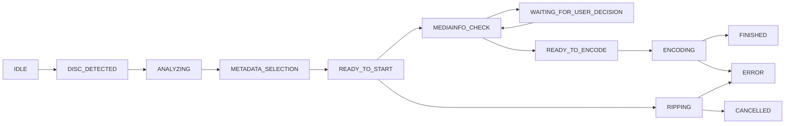

# Workflow & Zustände

Ripster steuert den Ablauf als State-Machine im `pipelineService`.

---

## Zustandsdiagramm (vereinfacht)

---

## State-Liste

| State | Bedeutung |
|------|-----------|
| `IDLE` | Wartet auf Disc |
| `DISC_DETECTED` | Disc erkannt |
| `ANALYZING` | MakeMKV-Analyse läuft |
| `METADATA_SELECTION` | Benutzer wählt Metadaten |
| `WAITING_FOR_USER_DECISION` | Playlist-Auswahl nötig |
| `READY_TO_START` | Übergangszustand vor Start |
| `RIPPING` | MakeMKV-Rip läuft |
| `MEDIAINFO_CHECK` | Quelle/Tracks werden ausgewertet |
| `READY_TO_ENCODE` | Review ist bereit |
| `ENCODING` | HandBrake läuft |
| `FINISHED` | erfolgreich abgeschlossen |
| `CANCELLED` | abgebrochen |
| `ERROR` | fehlgeschlagen |

---

## Typische Pfade

### Standardfall (kein vorhandenes RAW)

1. Disc erkannt
2. Analyse + Metadaten
3. `RIPPING`
4. `MEDIAINFO_CHECK`
5. `READY_TO_ENCODE`
6. `ENCODING`
7. `FINISHED`

### Vorhandenes RAW

`READY_TO_START` springt direkt zu `MEDIAINFO_CHECK` (kein neuer Rip).

### Mehrdeutige Blu-ray-Playlist

`MEDIAINFO_CHECK` -> `WAITING_FOR_USER_DECISION` bis Benutzer Playlist bestätigt.

---

## Queue-Verhalten

Wenn `pipeline_max_parallel_jobs` erreicht ist:

- Job-Aktionen werden als Queue-Einträge abgelegt
- Queue kann zusätzlich Nicht-Job-Einträge enthalten (`script`, `chain`, `wait`)
- Reihenfolge ist per API/UI änderbar

---

## Abbruch, Retry, Restart

- `cancel`: laufenden Job abbrechen oder Queue-Eintrag entfernen
- `retry`: Fehler-/Abbruch-Job neu starten
- `reencode`: aus vorhandenem RAW neu encodieren
- `restart-review`: Review aus RAW neu aufbauen
- `restart-encode`: Encoding mit letzter bestätigter Auswahl neu starten
