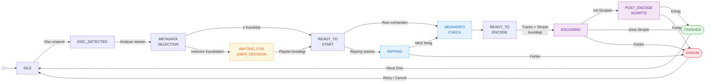

# Workflow & Zustände

Der Ripping-Workflow von Ripster ist als **State Machine** implementiert. Jeder Zustand hat klar definierte Übergangsbedingungen und Aktionen.

---

## Zustandsdiagramm

<div class="pipeline-diagram">



</div>

---

## Zustandsbeschreibungen

### IDLE

**Ausgangszustand.** Ripster wartet auf eine Disc.

- `diskDetectionService` pollt das Laufwerk im konfigurierten Intervall
- Bei Disc-Erkennung: automatischer Übergang zu `DISC_DETECTED`
- WebSocket-Event: `DISC_DETECTED`

---

### DISC_DETECTED

**Disc erkannt, wartet auf Benutzeraktion.**

- Dashboard zeigt **"Neue Disc erkannt"**-Badge
- **"Analyse starten"**-Button wird aktiv
- Kein Prozess läuft noch

**Übergang:** Benutzer klickt "Analyse starten" → `METADATA_SELECTION`

---

### METADATA_SELECTION

**Disc-Info-Scan läuft, danach Benutzer-Eingabe.**

1. MakeMKV wird im Info-Modus gestartet und liest alle Titel/Playlists
2. OMDb-Vorsuche mit erkanntem Disc-Label
3. `MetadataSelectionDialog` öffnet sich mit vorgeladenen Ergebnissen
4. Benutzer wählt Filmtitel (oder gibt manuell ein)
5. Nach Bestätigung: **Playlist-Analyse** läuft sofort durch

**Übergang (automatisch nach Playlist-Analyse):**

| Ergebnis der Analyse | Nächster Zustand |
|--------------------|-----------------|
| Nur ein Kandidat nach Mindestlänge | `READY_TO_START` |
| Mehrere Kandidaten nach Mindestlänge | `WAITING_FOR_USER_DECISION` |

---

### WAITING_FOR_USER_DECISION

**Playlist-Obfuskierung erkannt – manuelle Auswahl erforderlich.**

!!! info "Neu seit „Skript Integration + UI Anpassungen""
    Dieser Zustand wurde eingeführt, um Blu-rays mit mehreren Playlists ähnlicher Länge korrekt zu behandeln.

- Playlist-Auswahl-Dialog wird im Dashboard angezeigt
- Alle Kandidaten mit Score, Laufzeit und Bewertungslabel
- Empfohlene Playlist ist vorausgewählt
- Benutzer bestätigt mit **"Playlist übernehmen"**

**Darstellung im Dashboard:**

```
┌──────────────────────────────────────────────────────────┐
│ Playlist-Auswahl erforderlich                            │
│ Es wurden mehrere Titel mit ähnlicher Laufzeit gefunden. │
├──────────┬──────────┬────────┬──────────────────────────┤
│ Playlist │ Laufzeit │ Score  │ Bewertung                 │
├──────────┼──────────┼────────┼──────────────────────────┤
│ ● 00800  │ 2:28:05  │  +18   │ wahrscheinlich korrekt    │
│ ○ 00801  │ 2:28:12  │   −4   │ Auffällige Segmentfolge   │
│ ○ 00900  │ 2:28:05  │  −32   │ Fake-Struktur             │
└──────────┴──────────┴────────┴──────────────────────────┘
                              [Playlist übernehmen]
```

**Übergang:** `selectMetadata(jobId, { selectedPlaylist })` → `READY_TO_START`

Mehr Details: [Playlist-Analyse](playlist-analysis.md)

---

### READY_TO_START

**Metadaten und Playlist bestätigt, bereit zum Starten.**

- Job-Datensatz in Datenbank aktualisiert
- **"Starten"**-Button im Dashboard aktiv

**Sonderfall – Raw-Datei bereits vorhanden:**
Wenn für diesen Job bereits eine geri rippte Raw-Datei im `raw_dir` existiert (Pfad-Match über Metadaten-Basis), überspringt Ripster den Ripping-Schritt und springt direkt zum HandBrake-Scan.

**Übergang:** `startJob(jobId)` → `RIPPING` oder direkt `MEDIAINFO_CHECK`

---

### RIPPING

**MakeMKV rippt die Disc.**

=== "MKV-Modus (Standard)"

    ```bash
    makemkvcon mkv disc:0 all /path/to/raw/ --minlength=900 -r
    ```

    Erstellt MKV-Datei(en) direkt aus den gewählten Titeln.

=== "Backup-Modus"

    ```bash
    makemkvcon backup disc:0 /path/to/raw/backup/ --decrypt -r
    ```

    Erstellt vollständiges Disc-Backup inkl. Menüs.

**Live-Updates** aus MakeMKV-Ausgabe:

```
PRGV:2048,0,65536  → Fortschritt-Berechnung
PRGT:5011,0,"..."  → Aktueller Task-Name
```

**Typische Dauer:** DVD 20–45 min · Blu-ray 45–120 min

---

### MEDIAINFO_CHECK

**HandBrake-Scan und Encode-Plan-Erstellung.**

Dieser Zustand umfasst zwei Phasen:

1. **HandBrake-Scan** (`HandBrakeCLI --scan`) auf Disc oder Raw-Datei
2. **Encode-Plan-Erstellung** mit automatischer Track-Vorauswahl

Kein Benutzereingriff – läuft automatisch durch.

**Übergang:** → `READY_TO_ENCODE`

---

### READY_TO_ENCODE

**Encode-Plan bereit, wartet auf Benutzer-Bestätigung.**

Das `MediaInfoReviewPanel` zeigt:

- **Titel-Auswahl** (bei Discs mit mehreren langen Titeln)
- **Audio-Tracks** mit Encoder-Vorschau (Copy/Transcode/Fallback)
- **Untertitel-Tracks** mit Flags (Einbrennen, Forced, Default)
- **Post-Encode-Skripte** – Auswahl und Reihenfolge der auszuführenden Skripte

**Übergang:** `confirmEncodeReview(jobId, { tracks, scripts })` → `ENCODING`

---

### ENCODING

**HandBrake encodiert die Datei.**

```bash
HandBrakeCLI \
  -i <quelle> -o <ziel> \
  -t <titelId> \
  --preset "H.265 MKV 1080p30" \
  -a 1,2 -E copy:ac3,av_aac \
  -s 1 --subtitle-default 1
```

**Live-Updates** aus HandBrake-stderr:

```
Encoding: task 1 of 1, 73.50 % (45.23 fps, avg 44.12 fps, ETA 00h12m34s)
```

---

### POST_ENCODE_SCRIPTS

**Post-Encode-Skripte werden ausgeführt.**

!!! info "Neu seit „Skript Integration + UI Anpassungen""
    Post-Encode-Skripte ermöglichen es, nach erfolgreichem Encoding automatisch Aktionen auszuführen.

- Skripte werden **sequenziell** in der konfigurierten Reihenfolge ausgeführt
- Bei Fehler eines Skripts: restliche Skripte werden **abgebrochen**
- Ergebnis-Zusammenfassung wird im Job-Datensatz gespeichert:

```json
{
  "configured": 2,
  "succeeded": 2,
  "failed": 0,
  "skipped": 0,
  "aborted": false
}
```

Dieser Zustand wird nur erreicht, wenn im Encode-Review mindestens ein Skript ausgewählt wurde.

**Übergang:** → `FINISHED` (alle Skripte erfolgreich) oder `ERROR` (Skript-Fehler)

Details: [Post-Encode-Skripte](post-encode-scripts.md)

---

### FINISHED

**Job erfolgreich abgeschlossen.**

- Ausgabedatei liegt im konfigurierten `movie_dir`
- Job-Status in Datenbank: `FINISHED`
- PushOver-Benachrichtigung (falls konfiguriert)
- WebSocket-Event: `JOB_COMPLETE`

---

### ERROR

**Fehler aufgetreten.**

- Fehlerdetails im Job-Datensatz gespeichert
- Fehler-Logs in History abrufbar
- **Retry**: Neustart vom Fehlerzustand
- **Abbrechen**: Pipeline zurück zu IDLE

---

## Abbrechen & Retry

### Pipeline abbrechen

```http
POST /api/pipeline/cancel
```

- SIGINT → graceful exit (Timeout: 10 s) → SIGKILL
- Pipeline zurück zu IDLE

### Job wiederholen

```http
POST /api/pipeline/retry/:jobId
```

- Setzt Job zurück auf `READY_TO_START`
- Metadaten und Playlist-Auswahl bleiben erhalten

### Re-Encode

```http
POST /api/pipeline/reencode/:jobId
```

- Encodiert bestehende Raw-MKV neu
- Ermöglicht neue Track-Auswahl und andere Skripte
- Kein Ripping erforderlich
