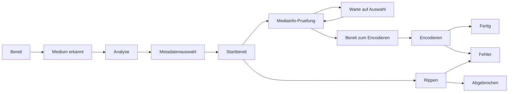

# Workflow & Zustände

Ripster steuert den Ablauf als Zustandsmaschine.

---

## Zustandsdiagramm (vereinfacht)

---

## Statusliste (GUI-Anzeige)

| Status in der GUI | Bedeutung |
|---|---|
| `Bereit` | Wartet auf Disc |
| `Medium erkannt` | Disc wurde erkannt |
| `Analyse` | MakeMKV-Analyse läuft |
| `Metadatenauswahl` | Metadaten müssen bestätigt werden |
| `Warte auf Auswahl` | Playlist-Auswahl ist erforderlich |
| `Startbereit` | kurzer Übergang vor Start |
| `Rippen` | MakeMKV-Rip läuft |
| `Mediainfo-Pruefung` | Titel/Spuren werden ausgewertet |
| `Bereit zum Encodieren` | Review ist bereit |
| `Encodieren` | HandBrake läuft |
| `Fertig` | erfolgreich abgeschlossen |
| `Abgebrochen` | manuell oder technisch abgebrochen |
| `Fehler` | fehlgeschlagen |

---

## Typische Pfade

### Standardfall (kein vorhandenes RAW)

1. Medium erkannt
2. Analyse + Metadaten
3. Rippen
4. Mediainfo-Pruefung
5. Bereit zum Encodieren
6. Encodieren
7. Fertig

### Vorhandenes RAW

`Startbereit` springt direkt zu `Mediainfo-Pruefung` (kein neuer Rip).

### Mehrdeutige Blu-ray-Playlist

`Mediainfo-Pruefung` -> `Warte auf Auswahl` bis Playlist bestätigt wurde.

---

## Queue-Verhalten

Wenn der Wert `Parallele Jobs` erreicht ist:

- neue Starts werden als Queue-Einträge abgelegt
- die Queue kann zusätzlich Nicht-Job-Einträge enthalten (`Skript`, `Kette`, `Warten`)
- Reihenfolge ist per UI/API änderbar

---

## Abbruch, Wiederaufnahme, Neustart

- `Abbrechen`: laufenden Job stoppen oder Queue-Eintrag entfernen
- `Retry Rippen`: Fehler-/Abbruch-Job erneut starten
- `RAW neu encodieren`: aus vorhandenem RAW neu encodieren
- `Review neu starten`: Review aus RAW neu aufbauen
- `Encode neu starten`: Encoding mit letzter bestätigter Auswahl neu starten
