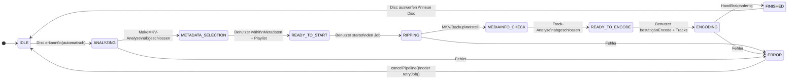

# Workflow & Zustände

Der Ripping-Workflow von Ripster ist als **State Machine** implementiert. Jeder Zustand hat klar definierte Übergangsbedingungen und Aktionen.

---

## Zustandsdiagramm



---

## Zustandsbeschreibungen

### IDLE

**Ausgangszustand.** Ripster wartet auf eine Disc.

- `diskDetectionService` pollt das Laufwerk (Intervall konfigurierbar)
- Bei Disc-Erkennung: Automatischer Übergang zu `ANALYZING`
- WebSocket-Event: `DISC_DETECTED`

---

### ANALYZING

**MakeMKV analysiert die Disc-Struktur.**

```bash
makemkvcon -r info disc:0
```

- Liest Titel-Informationen, Playlist-Liste, Track-Details
- Fortschritt wird über WebSocket übertragen
- Bei Blu-ray: Playlist-Liste für spätere Analyse gesammelt
- Dauer: 30 Sekunden bis 5 Minuten

**Ausgabe:** JSON-Struktur mit allen Titeln und Playlists

---

### METADATA_SELECTION

**Wartet auf Benutzer-Eingabe.**

- `MetadataSelectionDialog` wird im Frontend angezeigt
- Benutzer sucht in OMDb nach dem Filmtitel
- Benutzer wählt einen Eintrag aus den Suchergebnissen
- Bei Blu-ray: Playlist-Auswahl (mit Empfehlung durch `playlistAnalysis.js`)

**Übergang:** `selectMetadata(jobId, omdbData, playlist)` aufrufen

---

### READY_TO_START

**Metadaten bestätigt, bereit zum Starten.**

- Job-Datensatz in Datenbank mit Metadaten aktualisiert
- Start-Button im Dashboard aktiv
- Benutzer kann Metadaten noch mal ändern

**Übergang:** `startJob(jobId)` aufrufen

---

### RIPPING

**MakeMKV rippt die Disc.**

=== "MKV-Modus (Standard)"

    ```bash
    makemkvcon mkv disc:0 all /path/to/raw/ \
      --minlength=900
    ```

    Erstellt MKV-Datei(en) direkt aus den gewählten Titeln.

=== "Backup-Modus"

    ```bash
    makemkvcon backup disc:0 /path/to/raw/backup/ \
      --decrypt
    ```

    Erstellt vollständiges Disc-Backup inkl. Menüs.

**Live-Updates:** Fortschritt wird zeilenweise aus MakeMKV-Ausgabe geparst:

```
PRGC:5012,0,2048   → Fortschritt: X%
PRGT:5011,0,"..."  → Aktueller Task
```

---

### MEDIAINFO_CHECK

**MediaInfo analysiert die gerippte Datei.**

```bash
mediainfo --Output=JSON /path/to/raw/file.mkv
```

- Liest alle Audio-, Untertitel- und Video-Tracks
- Extrahiert Codec-Informationen (DTS, TrueHD, AC-3, ...)
- Bestimmt Sprachcodes (ISO 639)
- Erstellt Encode-Plan via `encodePlan.js`

---

### READY_TO_ENCODE

**Encode-Plan erstellt, wartet auf Bestätigung.**

- `MediaInfoReviewPanel` wird im Frontend angezeigt
- Benutzer kann Audio- und Untertitel-Tracks de/aktivieren
- Vorgeschlagene Tracks basierend auf Sprach-Einstellungen

**Übergang:** `confirmEncode(jobId, trackSelection)` aufrufen

---

### ENCODING

**HandBrake encodiert die Datei.**

```bash
HandBrakeCLI \
  --input /path/to/raw.mkv \
  --output /path/to/movies/Inception\ \(2010\).mkv \
  --preset "H.265 MKV 1080p30" \
  --audio 1,2 \
  --subtitle 1
```

**Live-Updates:** Fortschritt wird aus HandBrake-stderr geparst:

```
Encoding: task 1 of 1, 73.50 %
```

---

### FINISHED

**Job erfolgreich abgeschlossen.**

- Ausgabedatei liegt im konfigurierten `movie_dir`
- Job-Status in Datenbank auf `FINISHED` gesetzt
- PushOver-Benachrichtigung (falls konfiguriert)
- WebSocket-Event: `JOB_COMPLETE`

---

### ERROR

**Fehler aufgetreten.**

- Fehlerdetails im Job-Datensatz gespeichert
- Fehler-Logs verfügbar in der History
- **Retry**: Job kann vom Fehlerzustand neu gestartet werden
- **Abbrechen**: Pipeline zurück zu IDLE

---

## Abbrechen & Retry

### Pipeline abbrechen

```http
POST /api/pipeline/cancel
```

- Sendet SIGINT an aktiven Prozess
- Wartet auf graceful exit (Timeout: 10 Sekunden)
- Falls kein graceful exit: SIGKILL
- Pipeline-Zustand zurück zu IDLE

### Job wiederholen

```http
POST /api/pipeline/retry/:jobId
```

- Setzt Job-Status zurück auf `READY_TO_START`
- Behält Metadaten und Playlist-Auswahl
- Pipeline neu starten mit vorhandenen Daten

### Re-Encode

```http
POST /api/pipeline/reencode/:jobId
```

- Encodiert bestehende Raw-MKV neu
- Nützlich für geänderte Encoding-Einstellungen
- Kein neues Ripping erforderlich
